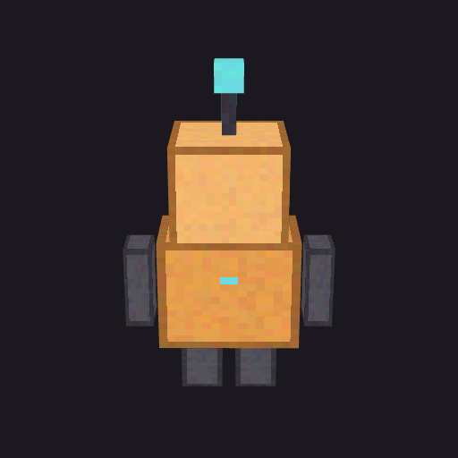

# bbspin

Turntable GIFs from Blockbench models, rendered in your browser.

**Use it at [bbspin.lucasfrederico.dev](https://bbspin.lucasfrederico.dev). Nothing to install.**



Model commissions and server showcases run on preview GIFs, and the usual way
to make one is screen-recording the Blockbench viewport by hand. bbspin skips
that: drop the `.bbmodel`, tune the spin, download the GIF.

## What it does

- Drag a `.bbmodel` in and it starts spinning immediately
- Size, frame count, spin duration, camera pitch, background color or a
  transparent background
- Exports a looping GIF encoded on the spot
- A bundled sample model, in case you just want to poke at it
- The UI speaks 11 languages and picks yours from the browser

Everything is client-side. three.js renders, gifenc encodes, and the model
never leaves your machine, which matters when the file is a paid commission.

## Scope

Cube elements with per-face UVs, the format ModelEngine blueprints and modern
Blockbench projects use. I tested it against models with a hundred-plus cubes
and grouped outliners. Meshes and keyframe animations are not rendered yet.

## How it works

The parser reads the subset of the format that matters for rendering: cubes,
faces, textures and the outliner tree. Each cube becomes a `BoxGeometry`
whose UV attribute is rewritten from the Blockbench face rects, with per-face
rotation handled in one pure function. The camera fits the model's bounding
sphere into the field of view, spins it, and each frame is quantized and
written by gifenc. Parsing and the UV math are covered by tests.

## Develop

```sh
npm install
npm run dev     # local app
npm test        # parser + UV tests
npm run build   # type-check and bundle
```

## License

MIT
